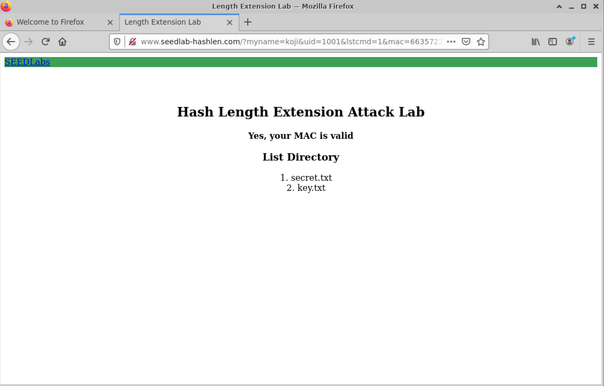
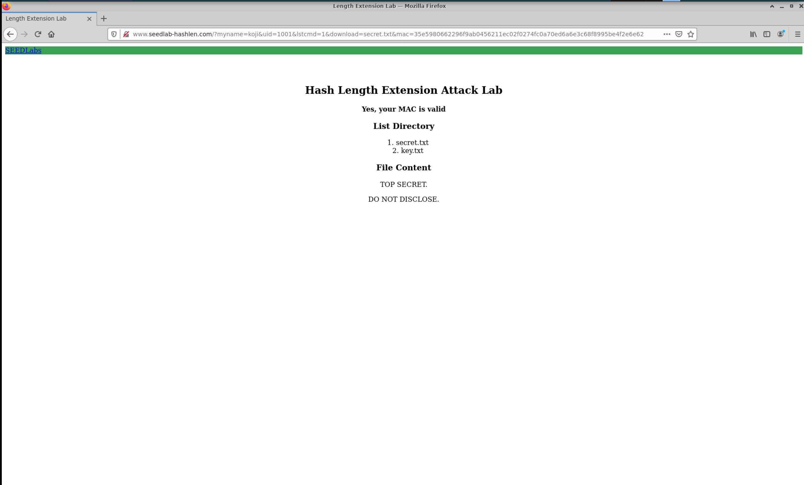

Instruction: https://seedsecuritylabs.org/Labs_20.04/Crypto/Crypto_Hash_Length_Ext/

# Lab Environment

Set up the container and run it (`www-10.9.0.80`) in the background:

```sh
curl https://seedsecuritylabs.org/Labs_20.04/Files/Crypto_Hash_Length_Ext/Labsetup.zip -o Labsetup.zip
unzip Labsetup.zip
cd Labsetup
dcbuild
dcup -d
```

If necessary, get the running container id by `dockps` and use `docksh <id>` to start a shell on this container.

Add the following entry in `/etc/hosts` *(root privilege required, try `sudo vi /etc/hosts`)*:

```
10.9.0.80 www.seedlab-hashlen.com
```

# Task 1

Construct and send a benign request to the server:

1. Pick up a `uid` with its key value from `Labsetup/image_flask/app/LabHome/key.txt` instead of using a real name, for example, I choose the entry `1001:123456` in this task.
2. Calculate the MAC of the key concatenated with request content `R`, that is

```
Key:R = 123456:myname=koji&uid=1001&lstcmd=1
```

Suppose that the name used here is "koji" and it requests for listing all the files in `LabHome` folder.

So the MAC is calculated as:

```sh
echo -n "123456:myname=koji&uid=1001&lstcmd=1" | sha256sum
#66357225216e2e9d1eb27b44fcfaa4c60f9955a7f1318ce5e757c9ef07e6c92d  -
```

Thus the complete request is:

```
http://www.seedlab-hashlen.com/?myname=koji&uid=1001&lstcmd=1&mac=66357225216e2e9d1eb27b44fcfaa4c60f9955a7f1318ce5e757c9ef07e6c92d
```

*Don't use `curl` or `wget`, it doesn't support. Just open a Firefox browser via VNC client and visit the url link above.*

The web looks like:



For a download request, we take a similar strategy to construct:

```
http://www.seedlab-hashlen.com/?myname=koji&uid=1001&lstcmd=1&download=secret.txt&mac=35e5980662296f9ab0456211ec02f0274fc0a70ed6a6e3c68f8995be4f2e6e62
```



# Task 2

Construct the padding for 
```
123456:myname=koji&uid=koji&lstcmd=1
```

Use Python REPL to complete this work:

```sh
python
>>> payload = bytearray("123456:myname=koji&uid=koji&lstcmd=1",'utf8')
>>> len(payload)
36
>>> length_field = ((64-len(payload))*8).to_bytes(8,'big')
>>> length_field
b'\x00\x00\x00\x00\x00\x00\x00\xe0'
>>> padding = b'\x80' + b'\x00'*(64-len(payload)-1-8) + length_field
>>> padding
b'\x80\x00\x00\x00\x00\x00\x00\x00\x00\x00\x00\x00\x00\x00\x00\x00\x00\x00\x00\x00\x00\x00\x00\x00\x00\x00\x00\xe0'
>>> len(padding)
28
>>> payload + padding
bytearray(b'123456:myname=koji&uid=koji&lstcmd=1\x80\x00\x00\x00\x00\x00\x00\x00\x00\x00\x00\x00\x00\x00\x00\x00\x00\x00\x00\x00\x00\x00\x00\x00\x00\x00\x00\xe0')
```


